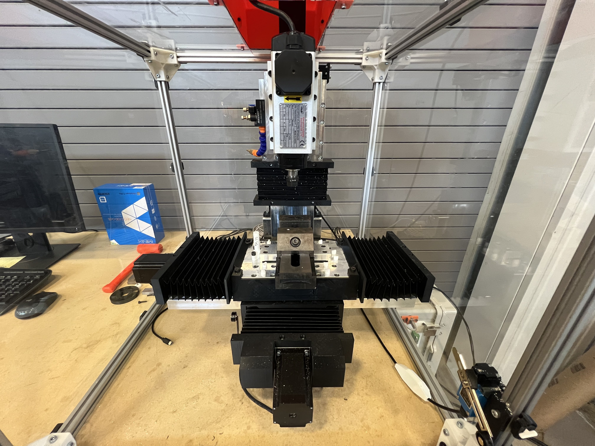
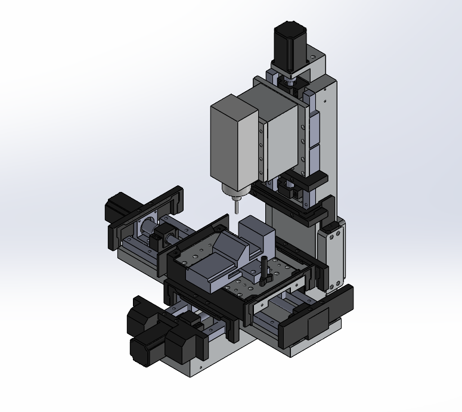
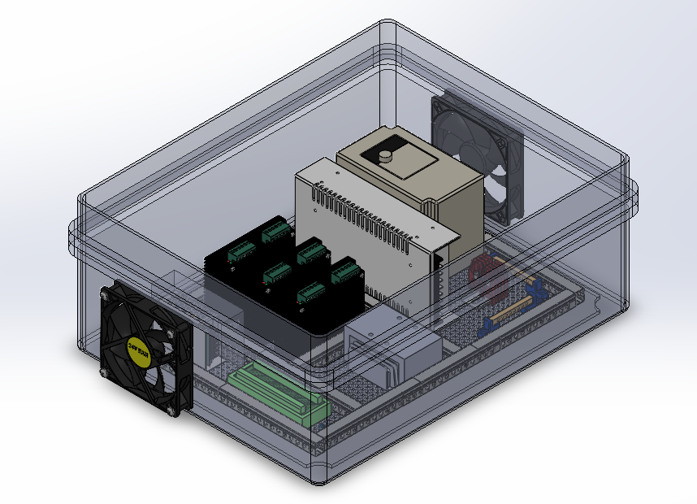
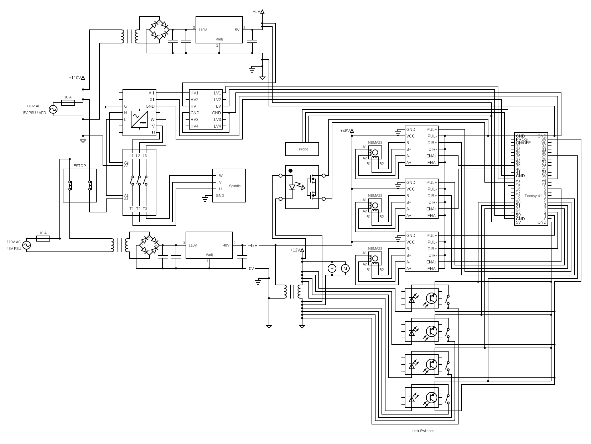
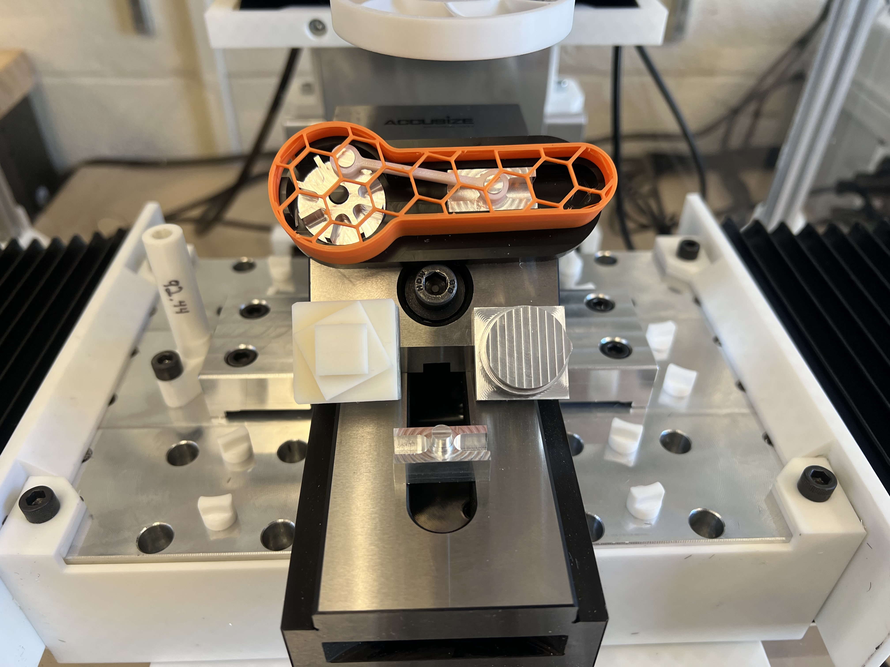
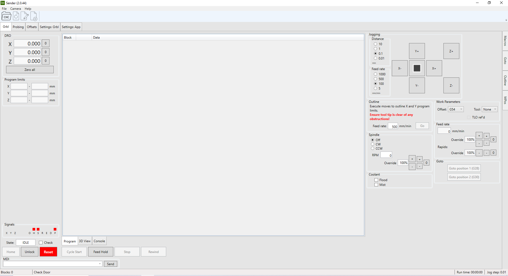

# Low-Cost CNC Desktop Milling Machine

# 

# |LC-CNC|

# This repository contains all necessary design files, instruction documents, and software binaries to build and run a low-cost desktop CNC machine. It includes: 

# \- Mechanical/Electrical design (SolidWorks files)

# \- Assembly + wiring instructions

# \- Educational curriculum tailored for the machine

# \- Open-source firmware and control software for ease of use

# \- Bill of Materials
# \- Performance evaluations (error motions and circle-diamond-square)
# \- User manuals and datasheets

#

# |Purchasing| (CNC-BoM.xlsx.)

# - All Machine/Electrical Components are required for the assembly of the LC-CNC

#	NOTE: The link to the carts are provided for ease of purchase when possible

# - All tools are required for successful assembly of the LC-CNC 

#	NOTE: Most tools are standard so only buy the specific tools you do not own

# - Recommendations are optional and only slightly improve user experience

#	NOTE: The table for the machine must be able to support 150lbs.

#	NOTE: Computer requirements: OS-Windows 10/11; Must have an ethernet port

#

# |Downloads|

# To avoid the need to navigate external GitHub repositories, the following software is bundled in the `binaries/` folder:

# -teensy.exe
# -ioSender.XL.2.0.46.zip
# -firmware.hex

# Download these versions that are known to work with the mechanical and electrical configuration provided in this repository. No modifications were made to the source code.

#

# |Getting Started|

# 1\. Purchase necessary items from CNC-BoM.xlsx.

# 2\. Assemble your machine using the instructions

# 3\. Flash `.hex` to your Teensy 4.1 using any Teensy-compatible flashing tool (teensy.exe)

# 4\. Download and extract `ioSender` from the provided ZIP

# 5\. Connect to your machine, configure settings, and start cutting! 

#

# |Educational Use|

# This project is tailored for use in schools, makerspaces, and research labs. The provided curriculum aligns with design and performance of this specific machine.

# We welcome improvements to documentation or curriculum under the same license terms.

#

# |License|

# All original work in this repository (CAD files, documentation, and curriculum) is licensed under the \*\*Creative Commons Attribution-NonCommercial-ShareAlike 4.0 International License (CC BY-NC-SA 4.0)\*\*.

# Read the full license terms here: https://creativecommons.org/licenses/by-nc-sa/4.0/ 

#

# |Third-Party Software|

# See `THIRD\_PARTY\_LICENSES.txt` for licensing details of the included firmware and sender application.

# \- grblHAL (GPL-3.0+)

# https://github.com/grblHAL

# \- ioSender (BSD-3-Clause)

# https://github.com/terjeio/ioSender

#

# |Credits|

# \- Original mechanical design and curriculum by Tyler Woodard, John Greene, and Colby Hale

# \- Firmware and sender software by Terje Io

# 

# Please respect original licenses when redistributing.

